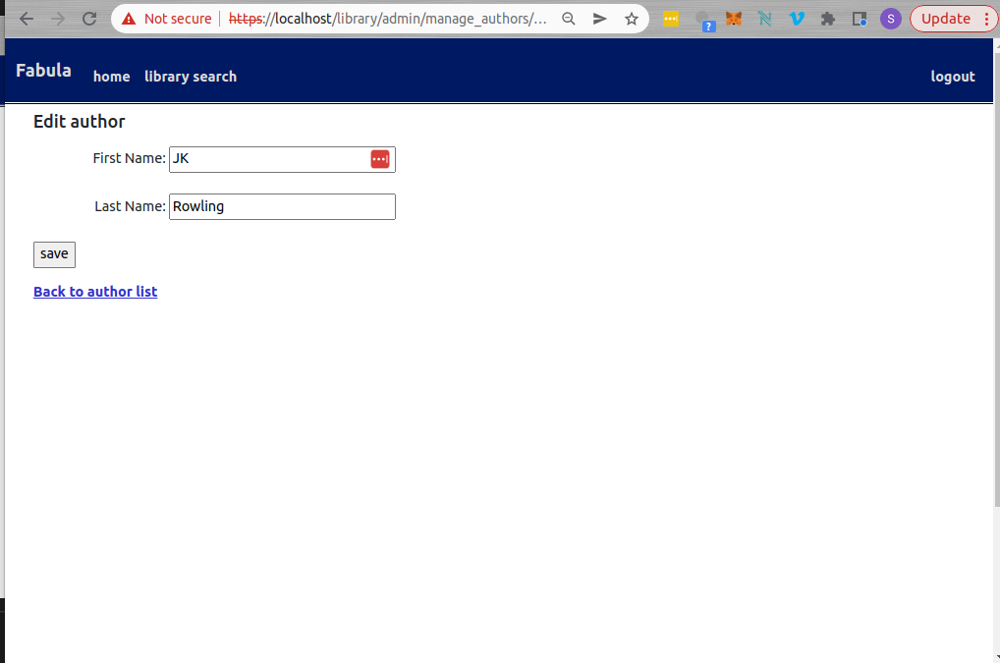
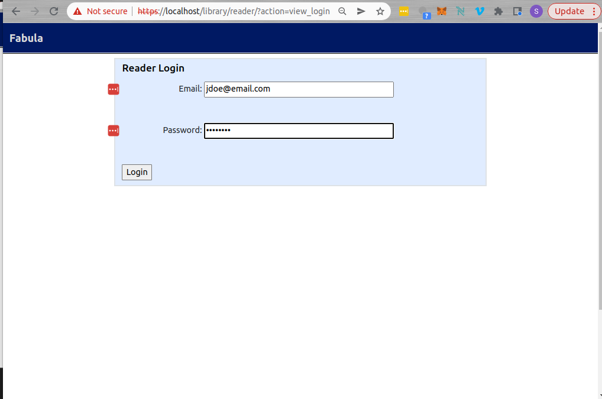

# Fabula Digital Library

This is a digital library built in PHP for storing pdf files of books.

## Requirements
This was built and tested using XAMPP for Linux 7.4.33-0
   - PHP 7.4.33
   - MariaDB 10.4.27
   - Apache 2.4.54

## Installation and Running Instructions
**1. Download XAMPP or manually set up an Apache web server with MariaDB and PHP**

XAMPP can be downloaded here: https://www.apachefriends.org/ 

**2. Run the Apache Web server on the localhost (either from the XAMPP GUI or from the command line)**

**3. Run the MariaDB database server on the localhost (either from the XAMPP GUI or from the command line)**

On Linux, step 2 and 3 can be done with the command: 

    $ sudo /opt/lampp/lampp start

**4. Open phpMyAdmin in a browser with https://localhost/phpMyAdmin**

**5. Create a non-root user for phpMyAdmin and protect the root username with a password.**

Initially login with the root username with no password (default), and change the password on the home screen in general setttings.

**6. Log into phpMyAdmin and run/import the file `library_db.sql` (in the current directory).**
   This creates and fills the database.

**7. Put the folder labeled library in the htdocs directory found here (if using XAMPP):**

    /opt/lampp/htdocs/

**8. Once the database is set up and running along with Apache, the web application can be accessed at:**
   http://localhost/library

*To log into the different portals, use the following test accounts:*

Admin:  
username: admin     
password:  remember  

Reader:
email: jdoe@email.com 
password: remember 

## **Demo**

1. Landing Page

2. Admin Login

3. Admin Portal
 
4. Manage Books

5. Add Book

6. Edit Book 

7. Manage Readers

8. Add Reader

9. Edit Reader

10. Manage Authors

11. Add Author

12. Edit Author

13. Search Library

14. Query in library

14. Reader Portal

15. Reader home

16. Reader -Search library 

